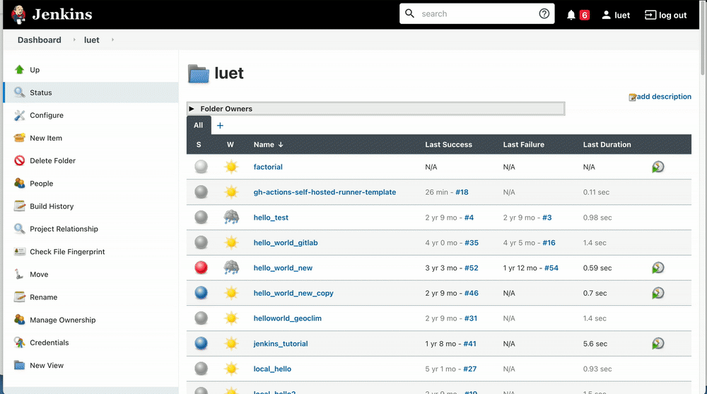
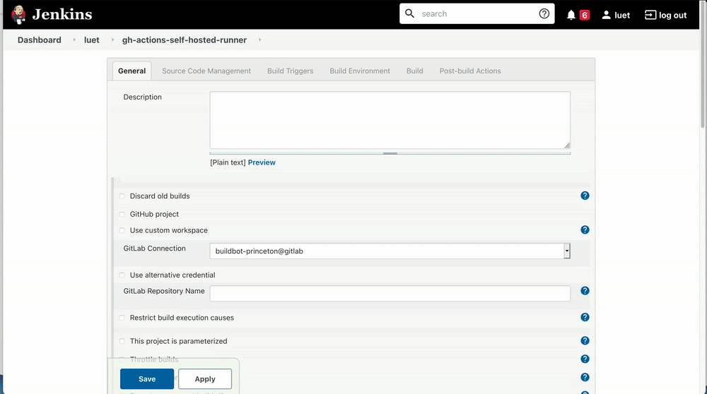
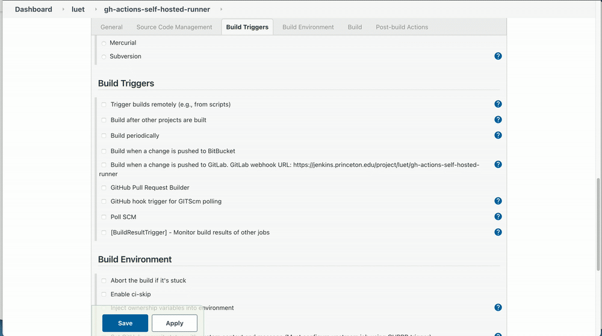
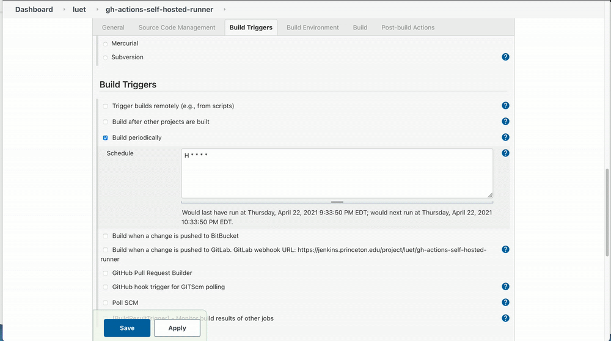

-   [GitHub](#github)
    -   [Define actions in Git repo](#define-actions-in-git-repo)
    -   [GitHub doc](#github-doc)
    -   [My example](#my-example)
-   [cluster (adroit)](#cluster-adroit)
    -   [Follow directions on GitHub](#follow-directions-on-github)
    -   [Create the script to check on the status of the
        runner](#create-the-script-to-check-on-the-status-of-the-runner)
-   [Configuring Jenkins to keep the runner
    alive](#configuring-jenkins-to-keep-the-runner-alive)

GitHub
======

Define actions in Git repo
--------------------------

GitHub doc
----------

My example
----------

<https://github.com/PrincetonUniversity/gh-actions-self-hosted.git>

cluster (adroit)
================

Follow directions on GitHub
---------------------------

Create the script to check on the status of the runner
------------------------------------------------------

The installation of the runner created a directory called
`actions-runners` on the agent machine. In this directory place the new
script: [./check-runner.sh](./check-runner.sh) You will need to change
those variables in the script:

``` {.shell}
LISTENER_PATH=/home/luet/actions-runner/bin/Runner.Listener
TMUX_SESSION_NAME=gh-runner
```

This is the script that will be executed by Jenkins to check on the
status of the runner and restart it if it is not running.

Note that this script uses a tmux session to run the runner in the
background. The advantage of using tmux instead of `nohup` is that it
creates a dashboard and logs of the jobs that ran through the runner.

The following screen recording show the worflow once the runner is
started is:

1.  connect to the cluster.

2.  attach to the tmux session with:

    ``` {.example}
    tmux a -t gh-runner
    ```

3.  A job has been triggered on GitHub. The runner shows what job has
    run and its status.

4.  After you are done looking at the runner\'s log, don\'t forget that
    you need to detach from the tmux session (with `CTRL+B` or simply
    killing the window) but you should not kill that session, otherwise
    it will kill the runner. 

Configuring Jenkins to keep the runner alive
============================================

1.  Connect to the Jenkins server. Remember that this requires you to be
    either on campus or on the VPN.

2.  Create new project 

3.  Enter description and discard old builds
    

4.  Restrict where the job can run. This is where you enter the name of
    your agent (`adroit_luet`) in this case.
    

5.  Set source code management to none
    

6.  Build trigger: build periodically (set to check every 1 hour)

    ``` {.example}
    H * * * *
    ```

    

7.  Build (bash shell execution)

    ``` {.shell}
    #!/bin/bash
    source /home/luet/actions-runner/check-runner.sh
    ```

    

8.  Set email triggers for failure (optional)

    -   Set Project Recipient list
    -   Select `Advanced`
        -   Select `trigger >> Failure any`

    

9.  Save.
