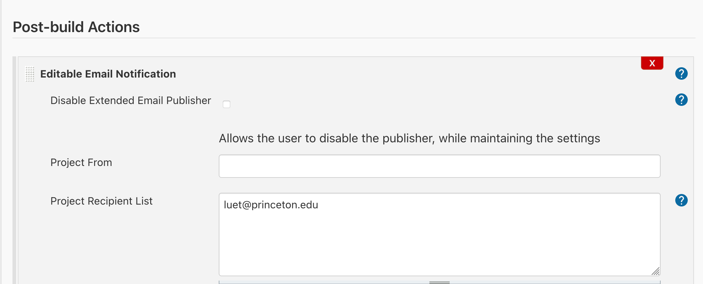

# Table of Contents

1.  [GitHub](#orgbdc8158)
    1.  [Define actions in Git repo](#orgb26207a)
    2.  [GitHub doc](#orgdf6c621)
    3.  [My example](#orgb1fbb39)
2.  [cluster (adroit)](#org065edd7)
    1.  [Follow directions on GitHub](#orge33b689)
    2.  [Create the script to check on the status of the runner](#orgce9ee8f)
3.  [Configuring Jenkins to keep the runner alive](#org0b1c9a8)

# GitHub

## Define actions in Git repo

## GitHub doc

## My example

<https://github.com/PrincetonUniversity/gh-actions-self-hosted.git>

# cluster (adroit)

## Follow directions on GitHub

## Create the script to check on the status of the runner

The installation of the runner created a directory called
`actions-runners` on the agent machine. In this directory place the
new script:
<./check-runner.sh>
You will need to change those variables in the script:

    LISTENER_PATH=/home/luet/actions-runner/bin/Runner.Listener
    TMUX_SESSION_NAME=gh-runner

This is the script that will be executed by Jenkins to check on the
status of the runner and restart it if it is not running.

Note that this script uses a tmux session to run the runner in the
background.  The advantage of using tmux instead of `nohup` is that it
creates a dashboard and logs of the jobs that ran through the runner.

The following screen recording show the worflow once the runner is started is:

1.  connect to the cluster.
2.  attach to the tmux session with:
    
        tmux a -t gh-runner
3.  A job has been triggered on GitHub. The runner shows what job has
    run and its status.
4.  After you are done looking at the runner's log, don't forget that
    you need to detach from the tmux session (with `CTRL+B` or simply
    killing the window) but you should not kill that session,
    otherwise it will kill the runner.

<./figures/tmux-attach-and-run-job.mp4>

# Configuring Jenkins to keep the runner alive

1.  Connect to the Jenkins server. Remember that this requires you to
    be either on campus or on the VPN.
2.  Create new project
    <./figures/create-new-project.mp4>
3.  Discard old builds
    <./figures/discard-olf-builds.mp4>
4.  Restrict where the job can run
    <./figures/restrict-where-jobs-can-run.mp4>
5.  Set source code management to none
    <./figures/source-code-management-none.mp4>
6.  Build trigger: build periodically (set to check every 1 hour)
    <./figures/periodic-build-trigger.mp4>
7.  Build (bash shell execution)
    <./figures/build-shell-execution.mp4>
8.  Set email triggers for failure (optional)
    -   Set Project Recipient list
        
        -   Select Advanced
            -   trigger Failure any
9.  Save

